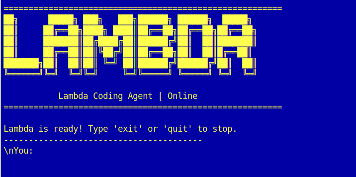

<p align="center">
  
</p>

<h1 align="center">Lambda Agent</h1>

<p align="center">
  <strong>A minimal, function-driven AI coding assistant built for speed and simplicity.</strong>
</p>

<p align="center">
  <a href="LICENSE"></a>
  
  
  
</p>

---

<p align="center">
  
</p>

---

## Overview

**Lambda** is a lightweight, command-line AI coding agent driven by Google's Gemini models. Unlike massive IDE extensions or bloated web setups, Lambda lives right in your terminal. It uses a ReAct (Reasoning and Acting) loop to autonomously navigate your codebase, read and write files, run shell commands, and orchestrate complex coding tasks from a single prompt.

With a beautiful UI powered by Rich, Lambda makes pair programming with AI feel fast, natural, and highly contextual.

## Key Features

- **Autonomous Tool Execution**: Powered by Gemini's function calling, Lambda can `read_file`, `write_file`, `search_repo`, and `run_command` directly on your host machine to get things done.
- **Agentic Scratchpad**: Lambda uses a hidden local scratchpad (`.scratchpad/`) to draft implementation plans, think through complex logic, and maintain context across long execution chains.
- **Stunning CLI Experience**: Built with [Rich](https://github.com/Textualize/rich), featuring distinct conversational bubbles, syntax highlighting, active token monitoring, and beautiful live spinners.
- **Hot-Swappable Models**: Instantly switch between different Gemini models mid-conversation using the `/models` slash command.
- **Zero-Friction Configuration**: Global configurations (`~/.config/lambda-agent/config.env`) mean you can run `lambda` in *any* directory on your machine instantly.

## Installation

Requires **Python 3.10+**. Install Lambda straight from the repository:

```bash
git clone https://github.com/ayusrjn/lambda.git
cd lambda
pip install .
```

*For local development and modifying the agent, use `pip install -e .` instead.*

## Usage

Spin up the agent from any directory simply by running:

```bash
lambda
```

### First-Time Setup
On your first run, Lambda will securely prompt you for your [Gemini API Key](https://aistudio.google.com/app/apikey) and model preference. This is saved to `~/.config/lambda-agent/config.env`.

*Note: You can override global settings by placing a `.env` file in your specific project directory.*

### Built-in Slash Commands

During your interactive session, you can use the following commands:
- `/models` — Display a menu to hot-swap your active AI model (e.g., from Gemini Flash to Pro).
- `/config` — Quickly update your API key mid-session.
- `/help`   — List all available slash commands.
- `exit` or `quit` — End the session and review your total token usage.

## Under the Hood

Lambda acts autonomously using an extensible set of Python tools:
- `search_repo(query, path)`: Deep file inspection ignoring `.git`, `.venv`, and binary caches.
- `run_command(command)`: Real shell execution (with 30s timeout guards).
- `ask_user(question)`: Ability to explicitly pause and ask the human for clarification.
- `read_file`, `write_file`: Direct file manipulations.
- **Scratchpad API**: `read_scratchpad`, `write_scratchpad`, `append_scratchpad` for planning.

## Contributing

Contributions make the open-source community an amazing place to learn and build!

1. Fork the Project
2. Create your Feature Branch (`git checkout -b feature/AmazingFeature`)
3. Commit your Changes (`git commit -m 'Add some AmazingFeature'`)
4. Push to the Branch (`git push origin feature/AmazingFeature`)
5. Open a Pull Request

## License & Attribution

Distributed under the Apache 2.0 License. See `LICENSE` for more information.

- Engine powered by [Google GenAI SDK](https://github.com/google/genai-python).
- Lambda icon by [shohanur.rahman13](https://www.flaticon.com/authors/shohanur-rahman13) from [Flaticon](https://www.flaticon.com/free-icons/lambda)
